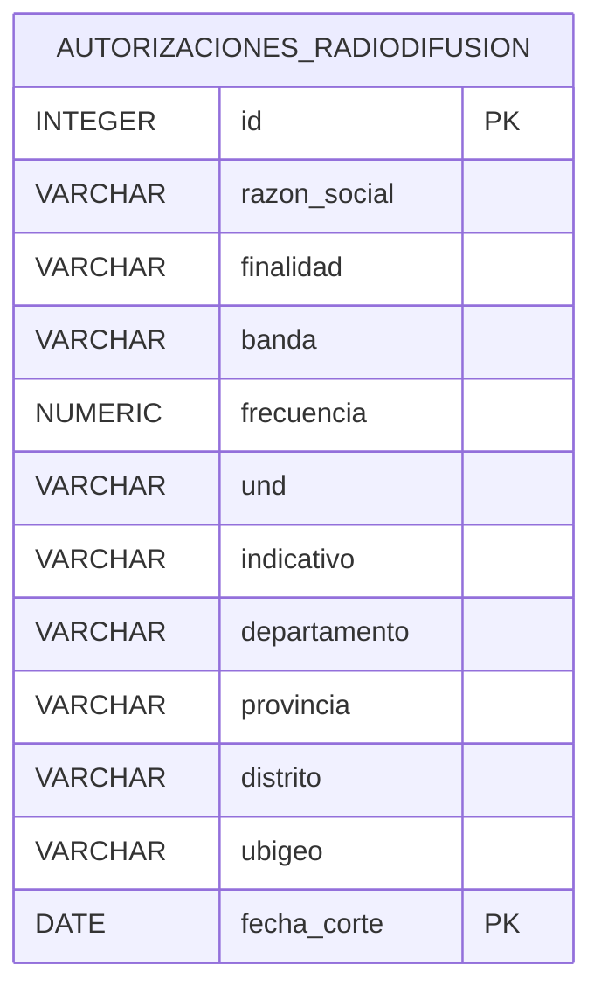
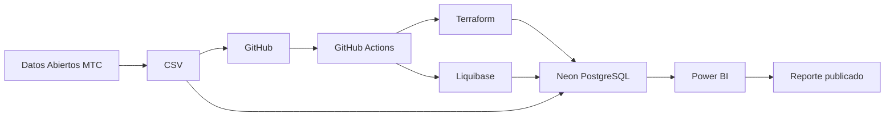
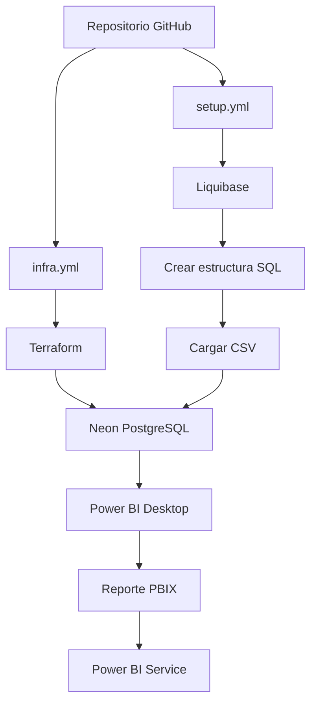

# Sistema de análisis de autorizaciones de radiodifusión – MTC

Proyecto académico para la implementación de una solución de datos en la nube utilizando PostgreSQL, Neon, Terraform, Liquibase, GitHub Actions y Power BI.

## 1. Dataset

**Fuente:** Plataforma Nacional de Datos Abiertos del Perú  
**Entidad:** Ministerio de Transportes y Comunicaciones (MTC)  
**Dataset:** Autorizaciones vigentes de radiodifusión sonora 2025-2026 I Semestre

Fuente oficial:
https://www.datosabiertos.gob.pe/dataset/autorizaciones-vigentes-de-radiodifusi%C3%B3n-sonora-2025-2026-i-semestre-ministerio-de

El archivo contiene información sobre autorizaciones de radiodifusión sonora otorgadas por el MTC.

- Registros: 18,417
- Columnas: 12
- Formato de origen: CSV
- Delimitador: punto y coma (`;`)
- Codificación: Latin-1
- Base de datos: PostgreSQL
- Servicio cloud: Neon

## 2. Diccionario de datos

| Campo | Tipo | Descripción |
|---|---|---|
| id | INTEGER | Identificador del registro |
| razon_social | VARCHAR(150) | Razón social del titular |
| finalidad | VARCHAR(30) | Finalidad de la autorización |
| banda | VARCHAR(10) | Banda de frecuencia |
| frecuencia | NUMERIC(10,3) | Frecuencia autorizada |
| und | VARCHAR(10) | Unidad de medida |
| indicativo | VARCHAR(20) | Indicativo de la estación |
| departamento | VARCHAR(50) | Departamento |
| provincia | VARCHAR(60) | Provincia |
| distrito | VARCHAR(80) | Distrito |
| ubigeo | VARCHAR(10) | Código UBIGEO |
| fecha_corte | DATE | Fecha de corte de la información |

La clave primaria utilizada es `(id, fecha_corte)`, permitiendo conservar registros correspondientes a diferentes cortes temporales.

## 3. Modelo de datos



## 4. Arquitectura



## 5. Automatización

El proyecto utiliza GitHub Actions mediante tres workflows.

### infra.yml

Provisiona la infraestructura PostgreSQL en Neon utilizando Terraform.

### setup.yml

Configura la base de datos mediante Liquibase y ejecuta la carga del dataset CSV a PostgreSQL.

### deploy.yml

Contiene el proceso de despliegue automatizado del reporte Power BI mediante la API de Power BI.

Para la ejecución automática del despliegue se requieren credenciales de Microsoft Entra almacenadas de forma segura mediante GitHub Secrets.

## 6. Flujo de despliegue



## 7. Reporte Power BI

El reporte contiene tres páginas principales:

### Resumen

Incluye indicadores generales, distribución de autorizaciones por departamento y finalidad, además de filtros por fecha de corte.

### Análisis

Permite analizar las autorizaciones según banda y ubicación geográfica, utilizando filtros interactivos.

### Detalle

Presenta los registros en formato tabular incluyendo razón social, finalidad, banda, frecuencia, departamento, provincia, distrito y fecha de corte.

Incluye un filtro por departamento.

## 8. Tecnologías utilizadas

- PostgreSQL
- Neon
- Terraform
- Liquibase
- GitHub
- GitHub Actions
- Power BI Desktop
- Power BI Service
- SQL
- DAX

## 9. Estructura del proyecto

```text
radiodifusion-mtc/
├── .github/
│   └── workflows/
│       ├── infra.yml
│       ├── setup.yml
│       └── deploy.yml
├── data/
│   └── autorizaciones_radiodifusion.csv
├── database/
│   ├── create_tables.sql
│   └── load_data.sql
├── liquibase/
│   └── changelog.xml
├── powerbi/
│   └── radiodifusion_mtc.pbix
├── terraform/
│   ├── versions.tf
│   ├── main.tf
│   └── outputs.tf
├── .gitignore
└── README.md
```

## 10. Enlaces

### Repositorio GitHub

https://github.com/RichiPodesta1113/radiodifusion-mtc

### Reporte Power BI

https://app.powerbi.com/groups/me/reports/07ca9929-0ba4-4c42-8382-c1a9e68495ec/b502aaddb5d74e39c7ab?experience=power-bi

> El acceso al reporte de Power BI está sujeto a los permisos configurados en Power BI Service.